# Class: DataStandardOrTool
_Represents a standard or tool in the Bridge2AI Standards Registry._


URI: [https://w3id.org/bridge2ai/standards-schema-all/:DataStandardOrTool](https://w3id.org/bridge2ai/standards-schema-all/:DataStandardOrTool)

```mermaid
 classDiagram
    class DataStandardOrTool
      NamedThing <|-- DataStandardOrTool
      
      DataStandardOrTool : collection
        DataStandardOrTool <.. StandardsCollectionTag : collection
      DataStandardOrTool : concerns_data_topic
        DataStandardOrTool <.. DataTopic : concerns_data_topic
      DataStandardOrTool : description
        DataStandardOrTool <.. string : description
      DataStandardOrTool : formal_specification
        DataStandardOrTool <.. uriorcurie : formal_specification
      DataStandardOrTool : has_relevant_organization
        DataStandardOrTool <.. Organization : has_relevant_organization
      DataStandardOrTool : id
        DataStandardOrTool <.. uriorcurie : id
      DataStandardOrTool : is_open
        DataStandardOrTool <.. boolean : is_open
      DataStandardOrTool : name
        DataStandardOrTool <.. string : name
      DataStandardOrTool : publication
        DataStandardOrTool <.. uriorcurie : publication
      DataStandardOrTool : purpose_detail
        DataStandardOrTool <.. string : purpose_detail
      DataStandardOrTool : related_to
        DataStandardOrTool <.. NamedThing : related_to
      DataStandardOrTool : requires_registration
        DataStandardOrTool <.. boolean : requires_registration
      DataStandardOrTool : subclass_of
        DataStandardOrTool <.. NamedThing : subclass_of
      DataStandardOrTool : url
        DataStandardOrTool <.. uriorcurie : url
      

      DataStandardOrTool <|-- DataStandard
      DataStandardOrTool <|-- Registry
      DataStandardOrTool <|-- OntologyOrVocabulary
      DataStandardOrTool <|-- ModelRepository
      DataStandardOrTool <|-- ReferenceDataOrDataset
      DataStandardOrTool <|-- SoftwareOrTool
      DataStandardOrTool <|-- ReferenceImplementation
      DataStandardOrTool <|-- TrainingProgram
      
      DataStandardOrTool : collection
        DataStandardOrTool <.. StandardsCollectionTag : collection
      DataStandardOrTool : concerns_data_topic
        DataStandardOrTool <.. DataTopic : concerns_data_topic
      DataStandardOrTool : description
        DataStandardOrTool <.. string : description
      DataStandardOrTool : formal_specification
        DataStandardOrTool <.. uriorcurie : formal_specification
      DataStandardOrTool : has_relevant_organization
        DataStandardOrTool <.. Organization : has_relevant_organization
      DataStandardOrTool : id
        DataStandardOrTool <.. uriorcurie : id
      DataStandardOrTool : is_open
        DataStandardOrTool <.. boolean : is_open
      DataStandardOrTool : name
        DataStandardOrTool <.. string : name
      DataStandardOrTool : publication
        DataStandardOrTool <.. uriorcurie : publication
      DataStandardOrTool : purpose_detail
        DataStandardOrTool <.. string : purpose_detail
      DataStandardOrTool : related_to
        DataStandardOrTool <.. NamedThing : related_to
      DataStandardOrTool : requires_registration
        DataStandardOrTool <.. boolean : requires_registration
      DataStandardOrTool : subclass_of
        DataStandardOrTool <.. NamedThing : subclass_of
      DataStandardOrTool : url
        DataStandardOrTool <.. uriorcurie : url
      
```





## Inheritance
* [NamedThing](NamedThing.md)
    * **DataStandardOrTool**
        * [DataStandard](DataStandard.md)
        * [Registry](Registry.md)
        * [OntologyOrVocabulary](OntologyOrVocabulary.md)
        * [ModelRepository](ModelRepository.md)
        * [ReferenceDataOrDataset](ReferenceDataOrDataset.md)
        * [SoftwareOrTool](SoftwareOrTool.md)
        * [ReferenceImplementation](ReferenceImplementation.md)
        * [TrainingProgram](TrainingProgram.md)


## Slots

| Name | Cardinality and Range | Description | Inheritance |
| ---  | --- | --- | --- |
| [collection](collection.md) | 0..* <br/> [StandardsCollectionTag](StandardsCollectionTag.md) | Tags for specific sets of standards | direct |
| [concerns_data_topic](concerns_data_topic.md) | 0..* <br/> [DataTopic](DataTopic.md) | Subject standard is generally applied in the context of object data topic | direct |
| [has_relevant_organization](has_relevant_organization.md) | 0..* <br/> [Organization](Organization.md) | Subject standard is managed or otherwise guided buy the object organization(s... | direct |
| [purpose_detail](purpose_detail.md) | 0..1 <br/> [String](String.md) | Text description of the standard or tool | direct |
| [is_open](is_open.md) | 0..1 <br/> [Boolean](Boolean.md) | Is the standard or tool FAIR and available free of cost? | direct |
| [requires_registration](requires_registration.md) | 0..1 <br/> [Boolean](Boolean.md) | Does usage of the standard or tool require registrion of a user or group with... | direct |
| [url](url.md) | 0..1 <br/> [Uriorcurie](Uriorcurie.md) | URL for basic documentation of the standard or tool | direct |
| [publication](publication.md) | 0..1 <br/> [Uriorcurie](Uriorcurie.md) | Relevant publication for the standard or tool | direct |
| [formal_specification](formal_specification.md) | 0..1 <br/> [Uriorcurie](Uriorcurie.md) | Relevant code repository or other location for a formal specification of the ... | direct |
| [id](id.md) | 1..1 <br/> [Uriorcurie](Uriorcurie.md) | A unique identifier for a thing | [NamedThing](NamedThing.md) |
| [name](name.md) | 0..1 <br/> [String](String.md) | A human-readable name for a thing | [NamedThing](NamedThing.md) |
| [description](description.md) | 0..1 <br/> [String](String.md) | A human-readable description for a thing | [NamedThing](NamedThing.md) |
| [subclass_of](subclass_of.md) | 0..* <br/> [NamedThing](NamedThing.md) | Holds between two classes where the domain class is a specialization of the r... | [NamedThing](NamedThing.md) |
| [related_to](related_to.md) | 0..* <br/> [NamedThing](NamedThing.md) | A relationship that is asserted between two named things | [NamedThing](NamedThing.md) |


## Usages

| used by | used in | type | used |
| ---  | --- | --- | --- |
| [UseCase](UseCase.md) | [standards_and_tools_for_dgp_use](standards_and_tools_for_dgp_use.md) | range | [DataStandardOrTool](DataStandardOrTool.md) |
| [UseCase](UseCase.md) | [alternative_standards_and_tools](alternative_standards_and_tools.md) | range | [DataStandardOrTool](DataStandardOrTool.md) |
| [DataStandardOrTool](DataStandardOrTool.md) | [concerns_data_topic](concerns_data_topic.md) | domain | [DataStandardOrTool](DataStandardOrTool.md) |
| [DataStandardOrTool](DataStandardOrTool.md) | [has_relevant_organization](has_relevant_organization.md) | domain | [DataStandardOrTool](DataStandardOrTool.md) |
| [DataStandard](DataStandard.md) | [concerns_data_topic](concerns_data_topic.md) | domain | [DataStandardOrTool](DataStandardOrTool.md) |
| [DataStandard](DataStandard.md) | [has_relevant_organization](has_relevant_organization.md) | domain | [DataStandardOrTool](DataStandardOrTool.md) |
| [BiomedicalStandard](BiomedicalStandard.md) | [concerns_data_topic](concerns_data_topic.md) | domain | [DataStandardOrTool](DataStandardOrTool.md) |
| [BiomedicalStandard](BiomedicalStandard.md) | [has_relevant_organization](has_relevant_organization.md) | domain | [DataStandardOrTool](DataStandardOrTool.md) |
| [Registry](Registry.md) | [concerns_data_topic](concerns_data_topic.md) | domain | [DataStandardOrTool](DataStandardOrTool.md) |
| [Registry](Registry.md) | [has_relevant_organization](has_relevant_organization.md) | domain | [DataStandardOrTool](DataStandardOrTool.md) |
| [OntologyOrVocabulary](OntologyOrVocabulary.md) | [concerns_data_topic](concerns_data_topic.md) | domain | [DataStandardOrTool](DataStandardOrTool.md) |
| [OntologyOrVocabulary](OntologyOrVocabulary.md) | [has_relevant_organization](has_relevant_organization.md) | domain | [DataStandardOrTool](DataStandardOrTool.md) |
| [ModelRepository](ModelRepository.md) | [concerns_data_topic](concerns_data_topic.md) | domain | [DataStandardOrTool](DataStandardOrTool.md) |
| [ModelRepository](ModelRepository.md) | [has_relevant_organization](has_relevant_organization.md) | domain | [DataStandardOrTool](DataStandardOrTool.md) |
| [ReferenceDataOrDataset](ReferenceDataOrDataset.md) | [concerns_data_topic](concerns_data_topic.md) | domain | [DataStandardOrTool](DataStandardOrTool.md) |
| [ReferenceDataOrDataset](ReferenceDataOrDataset.md) | [has_relevant_organization](has_relevant_organization.md) | domain | [DataStandardOrTool](DataStandardOrTool.md) |
| [SoftwareOrTool](SoftwareOrTool.md) | [concerns_data_topic](concerns_data_topic.md) | domain | [DataStandardOrTool](DataStandardOrTool.md) |
| [SoftwareOrTool](SoftwareOrTool.md) | [has_relevant_organization](has_relevant_organization.md) | domain | [DataStandardOrTool](DataStandardOrTool.md) |
| [ReferenceImplementation](ReferenceImplementation.md) | [concerns_data_topic](concerns_data_topic.md) | domain | [DataStandardOrTool](DataStandardOrTool.md) |
| [ReferenceImplementation](ReferenceImplementation.md) | [has_relevant_organization](has_relevant_organization.md) | domain | [DataStandardOrTool](DataStandardOrTool.md) |
| [TrainingProgram](TrainingProgram.md) | [concerns_data_topic](concerns_data_topic.md) | domain | [DataStandardOrTool](DataStandardOrTool.md) |
| [TrainingProgram](TrainingProgram.md) | [has_relevant_organization](has_relevant_organization.md) | domain | [DataStandardOrTool](DataStandardOrTool.md) |
| [DataStandardOrToolContainer](DataStandardOrToolContainer.md) | [data_standardortools_collection](data_standardortools_collection.md) | range | [DataStandardOrTool](DataStandardOrTool.md) |


## Identifier and Mapping Information


### Schema Source


* from schema: https://w3id.org/bridge2ai/standards-schema-all


## Mappings

| Mapping Type | Mapped Value |
| ---  | ---  |
| self | https://w3id.org/bridge2ai/standards-schema-all/:DataStandardOrTool |
| native | https://w3id.org/bridge2ai/standards-schema-all/:DataStandardOrTool |


## LinkML Source

<!-- TODO: investigate https://stackoverflow.com/questions/37606292/how-to-create-tabbed-code-blocks-in-mkdocs-or-sphinx -->

### Direct

<details>
```yaml
name: DataStandardOrTool
description: Represents a standard or tool in the Bridge2AI Standards Registry.
from_schema: https://w3id.org/bridge2ai/standards-schema-all
rank: 1000
is_a: NamedThing
slots:
- collection
- concerns_data_topic
- has_relevant_organization
- purpose_detail
- is_open
- requires_registration
- url
- publication
- formal_specification

```
</details>

### Induced

<details>
```yaml
name: DataStandardOrTool
description: Represents a standard or tool in the Bridge2AI Standards Registry.
from_schema: https://w3id.org/bridge2ai/standards-schema-all
rank: 1000
is_a: NamedThing
attributes:
  collection:
    name: collection
    description: Tags for specific sets of standards.
    from_schema: https://w3id.org/bridge2ai/standards-schema-all
    rank: 1000
    is_a: node property
    domain: NamedThing
    multivalued: true
    alias: collection
    owner: DataStandardOrTool
    domain_of:
    - DataStandardOrTool
    range: StandardsCollectionTag
  concerns_data_topic:
    name: concerns_data_topic
    description: Subject standard is generally applied in the context of object data
      topic.
    from_schema: https://w3id.org/bridge2ai/standards-schema-all
    rank: 1000
    is_a: related_to
    domain: DataStandardOrTool
    multivalued: true
    inherited: true
    alias: concerns_data_topic
    owner: DataStandardOrTool
    domain_of:
    - DataStandardOrTool
    range: DataTopic
  has_relevant_organization:
    name: has_relevant_organization
    description: Subject standard is managed or otherwise guided buy the object organization(s).
    from_schema: https://w3id.org/bridge2ai/standards-schema-all
    rank: 1000
    is_a: related_to
    domain: DataStandardOrTool
    multivalued: true
    inherited: true
    alias: has_relevant_organization
    owner: DataStandardOrTool
    domain_of:
    - DataStandardOrTool
    range: Organization
  purpose_detail:
    name: purpose_detail
    description: Text description of the standard or tool.
    from_schema: https://w3id.org/bridge2ai/standards-schema-all
    rank: 1000
    is_a: node property
    domain: NamedThing
    alias: purpose_detail
    owner: DataStandardOrTool
    domain_of:
    - DataStandardOrTool
    range: string
  is_open:
    name: is_open
    description: Is the standard or tool FAIR and available free of cost?
    from_schema: https://w3id.org/bridge2ai/standards-schema-all
    rank: 1000
    is_a: node property
    domain: NamedThing
    alias: is_open
    owner: DataStandardOrTool
    domain_of:
    - DataStandardOrTool
    range: boolean
  requires_registration:
    name: requires_registration
    description: Does usage of the standard or tool require registrion of a user or
      group with some organization or managerial body?
    from_schema: https://w3id.org/bridge2ai/standards-schema-all
    rank: 1000
    is_a: node property
    domain: NamedThing
    alias: requires_registration
    owner: DataStandardOrTool
    domain_of:
    - DataStandardOrTool
    range: boolean
  url:
    name: url
    description: URL for basic documentation of the standard or tool.
    from_schema: https://w3id.org/bridge2ai/standards-schema-all
    rank: 1000
    is_a: node property
    domain: NamedThing
    alias: url
    owner: DataStandardOrTool
    domain_of:
    - DataStandardOrTool
    - Organization
    range: uriorcurie
  publication:
    name: publication
    description: Relevant publication for the standard or tool. Prefer a DOI or PUBMED.
    from_schema: https://w3id.org/bridge2ai/standards-schema-all
    rank: 1000
    is_a: node property
    domain: NamedThing
    alias: publication
    owner: DataStandardOrTool
    domain_of:
    - DataStandardOrTool
    range: uriorcurie
  formal_specification:
    name: formal_specification
    description: Relevant code repository or other location for a formal specification
      of the standard or tool. Often a URL, particularly to a Git repository.
    from_schema: https://w3id.org/bridge2ai/standards-schema-all
    rank: 1000
    is_a: node property
    domain: NamedThing
    alias: formal_specification
    owner: DataStandardOrTool
    domain_of:
    - DataStandardOrTool
    range: uriorcurie
  id:
    name: id
    description: A unique identifier for a thing.
    from_schema: https://w3id.org/bridge2ai/standards-schema-all
    rank: 1000
    slot_uri: schema:identifier
    identifier: true
    alias: id
    owner: DataStandardOrTool
    domain_of:
    - NamedThing
    range: uriorcurie
    required: true
  name:
    name: name
    description: A human-readable name for a thing.
    from_schema: https://w3id.org/bridge2ai/standards-schema-all
    rank: 1000
    slot_uri: schema:name
    alias: name
    owner: DataStandardOrTool
    domain_of:
    - NamedThing
    range: string
  description:
    name: description
    description: A human-readable description for a thing.
    from_schema: https://w3id.org/bridge2ai/standards-schema-all
    rank: 1000
    slot_uri: schema:description
    alias: description
    owner: DataStandardOrTool
    domain_of:
    - NamedThing
    range: string
  subclass_of:
    name: subclass_of
    description: Holds between two classes where the domain class is a specialization
      of the range class.
    from_schema: https://w3id.org/bridge2ai/standards-schema-all
    exact_mappings:
    - rdfs:subClassOf
    - MESH:isa
    narrow_mappings:
    - rdfs:subPropertyOf
    rank: 1000
    is_a: related_to
    domain: NamedThing
    multivalued: true
    inherited: true
    alias: subclass_of
    owner: DataStandardOrTool
    domain_of:
    - NamedThing
    range: NamedThing
  related_to:
    name: related_to
    description: A relationship that is asserted between two named things.
    from_schema: https://w3id.org/bridge2ai/standards-schema-all
    rank: 1000
    domain: NamedThing
    multivalued: true
    inherited: true
    alias: related_to
    owner: DataStandardOrTool
    domain_of:
    - NamedThing
    - Organization
    symmetric: true
    range: NamedThing

```
</details>