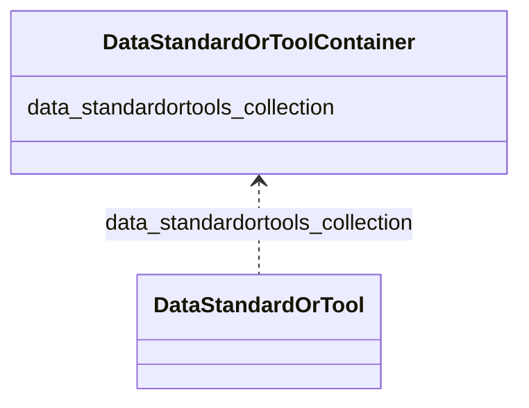

# Class: DataStandardOrToolContainer
_A container for DataStandardOrTool(s)._


URI: [https://w3id.org/bridge2ai/standards-schema-all/:DataStandardOrToolContainer](https://w3id.org/bridge2ai/standards-schema-all/:DataStandardOrToolContainer)





<!-- no inheritance hierarchy -->


## Slots

| Name | Cardinality and Range | Description | Inheritance |
| ---  | --- | --- | --- |
| [data_standardortools_collection](data_standardortools_collection.md) | 0..* <br/> [DataStandardOrTool](DataStandardOrTool.md) |  | direct |


## Identifier and Mapping Information


### Schema Source


* from schema: https://w3id.org/bridge2ai/standards-schema-all


## Mappings

| Mapping Type | Mapped Value |
| ---  | ---  |
| self | https://w3id.org/bridge2ai/standards-schema-all/:DataStandardOrToolContainer |
| native | https://w3id.org/bridge2ai/standards-schema-all/:DataStandardOrToolContainer |


## LinkML Source

<!-- TODO: investigate https://stackoverflow.com/questions/37606292/how-to-create-tabbed-code-blocks-in-mkdocs-or-sphinx -->

### Direct

<details>
```yaml
name: DataStandardOrToolContainer
description: A container for DataStandardOrTool(s).
from_schema: https://w3id.org/bridge2ai/standards-schema-all
rank: 1000
slots:
- data_standardortools_collection

```
</details>

### Induced

<details>
```yaml
name: DataStandardOrToolContainer
description: A container for DataStandardOrTool(s).
from_schema: https://w3id.org/bridge2ai/standards-schema-all
rank: 1000
attributes:
  data_standardortools_collection:
    name: data_standardortools_collection
    from_schema: https://w3id.org/bridge2ai/standards-schema-all
    rank: 1000
    multivalued: true
    alias: data_standardortools_collection
    owner: DataStandardOrToolContainer
    domain_of:
    - DataStandardOrToolContainer
    range: DataStandardOrTool
    inlined: true
    inlined_as_list: true

```
</details>