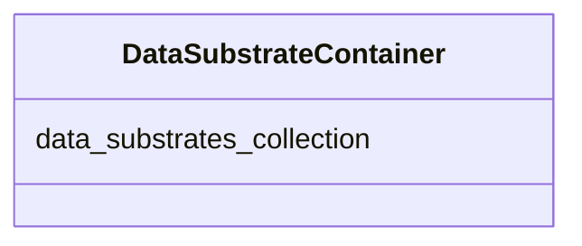

# Class: DataSubstrateContainer
_A container for DataSubstrates._


URI: [STANDARDSDATASUBSTRATE:DataSubstrateContainer](https://w3id.org/bridge2ai/standards-datasubstrate-schema/DataSubstrateContainer)





<!-- no inheritance hierarchy -->


## Slots

| Name | Cardinality and Range | Description | Inheritance |
| ---  | --- | --- | --- |
| [data_substrates_collection](data_substrates_collection.md) | 0..* <br/> [DataSubstrate](DataSubstrate.md) |  | direct |


## Identifier and Mapping Information


### Schema Source


* from schema: https://w3id.org/bridge2ai/standards-datasubstrate-schema


## Mappings

| Mapping Type | Mapped Value |
| ---  | ---  |
| self | STANDARDSDATASUBSTRATE:DataSubstrateContainer |
| native | STANDARDSDATASUBSTRATE:DataSubstrateContainer |


## LinkML Source

<!-- TODO: investigate https://stackoverflow.com/questions/37606292/how-to-create-tabbed-code-blocks-in-mkdocs-or-sphinx -->

### Direct

<details>
```yaml
name: DataSubstrateContainer
description: A container for DataSubstrates.
from_schema: https://w3id.org/bridge2ai/standards-datasubstrate-schema
rank: 1000
slots:
- data_substrates_collection

```
</details>

### Induced

<details>
```yaml
name: DataSubstrateContainer
description: A container for DataSubstrates.
from_schema: https://w3id.org/bridge2ai/standards-datasubstrate-schema
rank: 1000
attributes:
  data_substrates_collection:
    name: data_substrates_collection
    from_schema: https://w3id.org/bridge2ai/standards-datasubstrate-schema
    rank: 1000
    multivalued: true
    alias: data_substrates_collection
    owner: DataSubstrateContainer
    domain_of:
    - DataSubstrateContainer
    range: DataSubstrate
    inlined: true
    inlined_as_list: true

```
</details>