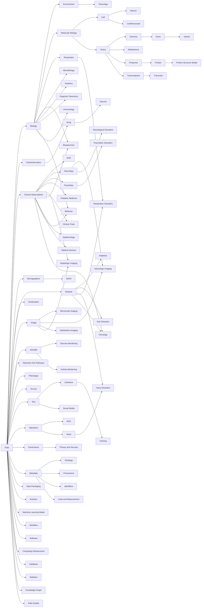

# Data Topics

<!-- TOPIC_DIAGRAM_START -->

```mermaid
flowchart LR
    B2AI_TOPIC_1[Biology]
    B2AI_TOPIC_2[Cell]
    B2AI_TOPIC_3[Cheminformatics]
    B2AI_TOPIC_4[Clinical Observations]
    B2AI_TOPIC_5[Data]
    B2AI_TOPIC_6[Demographics]
    B2AI_TOPIC_7[Disease]
    B2AI_TOPIC_8[Drug]
    B2AI_TOPIC_9[EHR]
    B2AI_TOPIC_10[EKG]
    B2AI_TOPIC_11[Environment]
    B2AI_TOPIC_12[Gene]
    B2AI_TOPIC_13[Genome]
    B2AI_TOPIC_14[Geolocation]
    B2AI_TOPIC_15[Image]
    B2AI_TOPIC_16[Literature]
    B2AI_TOPIC_17[Metabolome]
    B2AI_TOPIC_18[mHealth]
    B2AI_TOPIC_19[Microscale Imaging]
    B2AI_TOPIC_20[Molecular Biology]
    B2AI_TOPIC_21[Networks And Pathways]
    B2AI_TOPIC_22[Neurologic Imaging]
    B2AI_TOPIC_23[Omics]
    B2AI_TOPIC_24[Ophthalmic Imaging]
    B2AI_TOPIC_25[Phenotype]
    B2AI_TOPIC_26[Protein]
    B2AI_TOPIC_27[Protein Structure Model]
    B2AI_TOPIC_28[Proteome]
    B2AI_TOPIC_29[SDoH]
    B2AI_TOPIC_30[Social Media]
    B2AI_TOPIC_31[Survey]
    B2AI_TOPIC_32[Text]
    B2AI_TOPIC_33[Transcript]
    B2AI_TOPIC_34[Transcriptome]
    B2AI_TOPIC_35[Variant]
    B2AI_TOPIC_36[Voice]
    B2AI_TOPIC_37[Waveform]
    B2AI_TOPIC_38[Glucose Monitoring]
    B2AI_TOPIC_39[Activity Monitoring]
    B2AI_TOPIC_40[Governance]
    B2AI_TOPIC_41[Neuron]
    B2AI_TOPIC_42[Cardiomyocyte]
    B2AI_TOPIC_43[Diabetes]
    B2AI_TOPIC_44[Eye Diseases]
    B2AI_TOPIC_45[Voice Disorders]
    B2AI_TOPIC_46[Respiration]
    B2AI_TOPIC_47[Respiratory Disorders]
    B2AI_TOPIC_48[Neurology]
    B2AI_TOPIC_49[Neurological Disorders]
    B2AI_TOPIC_50[Psychiatry]
    B2AI_TOPIC_51[Psychiatric Disorders]
    B2AI_TOPIC_52[Training]
    B2AI_TOPIC_53[Ontology]
    B2AI_TOPIC_54[Metadata]
    B2AI_TOPIC_55[Data Packaging]
    B2AI_TOPIC_56[Nutrition]
    B2AI_TOPIC_57[Pediatric Medicine]
    B2AI_TOPIC_58[Machine Learning Model]
    B2AI_TOPIC_59[Workflow]
    B2AI_TOPIC_60[Software]
    B2AI_TOPIC_61[Computing Infrastructure]
    B2AI_TOPIC_62[Database]
    B2AI_TOPIC_63[Provenance]
    B2AI_TOPIC_64[Identifiers]
    B2AI_TOPIC_65[Radiologic Imaging]
    B2AI_TOPIC_66[Clinical Trials]
    B2AI_TOPIC_67[Biospecimen]
    B2AI_TOPIC_68[Epidemiology]
    B2AI_TOPIC_69[Microbiology]
    B2AI_TOPIC_70[Vaccine]
    B2AI_TOPIC_71[Anatomy]
    B2AI_TOPIC_72[Organism Taxonomy]
    B2AI_TOPIC_73[Units and Measurement]
    B2AI_TOPIC_74[Statistics]
    B2AI_TOPIC_75[Knowledge Graph]
    B2AI_TOPIC_76[Toxicology]
    B2AI_TOPIC_77[Privacy and Security]
    B2AI_TOPIC_78[Data Quality]
    B2AI_TOPIC_79[Medical Devices]
    B2AI_TOPIC_80[Behavior]
    B2AI_TOPIC_81[Oncology]
    B2AI_TOPIC_82[Immunology]
    B2AI_TOPIC_1 --> B2AI_TOPIC_11
    B2AI_TOPIC_1 --> B2AI_TOPIC_20
    B2AI_TOPIC_1 --> B2AI_TOPIC_46
    B2AI_TOPIC_1 --> B2AI_TOPIC_67
    B2AI_TOPIC_1 --> B2AI_TOPIC_69
    B2AI_TOPIC_1 --> B2AI_TOPIC_71
    B2AI_TOPIC_1 --> B2AI_TOPIC_72
    B2AI_TOPIC_1 --> B2AI_TOPIC_80
    B2AI_TOPIC_1 --> B2AI_TOPIC_82
    B2AI_TOPIC_2 --> B2AI_TOPIC_41
    B2AI_TOPIC_2 --> B2AI_TOPIC_42
    B2AI_TOPIC_3 --> B2AI_TOPIC_8
    B2AI_TOPIC_4 --> B2AI_TOPIC_9
    B2AI_TOPIC_4 --> B2AI_TOPIC_48
    B2AI_TOPIC_4 --> B2AI_TOPIC_50
    B2AI_TOPIC_4 --> B2AI_TOPIC_57
    B2AI_TOPIC_4 --> B2AI_TOPIC_65
    B2AI_TOPIC_4 --> B2AI_TOPIC_66
    B2AI_TOPIC_4 --> B2AI_TOPIC_67
    B2AI_TOPIC_4 --> B2AI_TOPIC_68
    B2AI_TOPIC_4 --> B2AI_TOPIC_79
    B2AI_TOPIC_4 --> B2AI_TOPIC_80
    B2AI_TOPIC_4 --> B2AI_TOPIC_81
    B2AI_TOPIC_5 --> B2AI_TOPIC_1
    B2AI_TOPIC_5 --> B2AI_TOPIC_3
    B2AI_TOPIC_5 --> B2AI_TOPIC_4
    B2AI_TOPIC_5 --> B2AI_TOPIC_6
    B2AI_TOPIC_5 --> B2AI_TOPIC_7
    B2AI_TOPIC_5 --> B2AI_TOPIC_14
    B2AI_TOPIC_5 --> B2AI_TOPIC_15
    B2AI_TOPIC_5 --> B2AI_TOPIC_18
    B2AI_TOPIC_5 --> B2AI_TOPIC_21
    B2AI_TOPIC_5 --> B2AI_TOPIC_25
    B2AI_TOPIC_5 --> B2AI_TOPIC_31
    B2AI_TOPIC_5 --> B2AI_TOPIC_32
    B2AI_TOPIC_5 --> B2AI_TOPIC_37
    B2AI_TOPIC_5 --> B2AI_TOPIC_40
    B2AI_TOPIC_5 --> B2AI_TOPIC_54
    B2AI_TOPIC_5 --> B2AI_TOPIC_55
    B2AI_TOPIC_5 --> B2AI_TOPIC_56
    B2AI_TOPIC_5 --> B2AI_TOPIC_58
    B2AI_TOPIC_5 --> B2AI_TOPIC_59
    B2AI_TOPIC_5 --> B2AI_TOPIC_60
    B2AI_TOPIC_5 --> B2AI_TOPIC_61
    B2AI_TOPIC_5 --> B2AI_TOPIC_62
    B2AI_TOPIC_5 --> B2AI_TOPIC_74
    B2AI_TOPIC_5 --> B2AI_TOPIC_75
    B2AI_TOPIC_5 --> B2AI_TOPIC_78
    B2AI_TOPIC_6 --> B2AI_TOPIC_29
    B2AI_TOPIC_7 --> B2AI_TOPIC_43
    B2AI_TOPIC_7 --> B2AI_TOPIC_44
    B2AI_TOPIC_7 --> B2AI_TOPIC_45
    B2AI_TOPIC_7 --> B2AI_TOPIC_47
    B2AI_TOPIC_7 --> B2AI_TOPIC_81
    B2AI_TOPIC_8 --> B2AI_TOPIC_70
    B2AI_TOPIC_11 --> B2AI_TOPIC_76
    B2AI_TOPIC_12 --> B2AI_TOPIC_35
    B2AI_TOPIC_13 --> B2AI_TOPIC_12
    B2AI_TOPIC_15 --> B2AI_TOPIC_19
    B2AI_TOPIC_15 --> B2AI_TOPIC_22
    B2AI_TOPIC_15 --> B2AI_TOPIC_24
    B2AI_TOPIC_15 --> B2AI_TOPIC_65
    B2AI_TOPIC_16 --> B2AI_TOPIC_52
    B2AI_TOPIC_18 --> B2AI_TOPIC_38
    B2AI_TOPIC_18 --> B2AI_TOPIC_39
    B2AI_TOPIC_20 --> B2AI_TOPIC_2
    B2AI_TOPIC_20 --> B2AI_TOPIC_23
    B2AI_TOPIC_23 --> B2AI_TOPIC_13
    B2AI_TOPIC_23 --> B2AI_TOPIC_17
    B2AI_TOPIC_23 --> B2AI_TOPIC_28
    B2AI_TOPIC_23 --> B2AI_TOPIC_34
    B2AI_TOPIC_26 --> B2AI_TOPIC_27
    B2AI_TOPIC_28 --> B2AI_TOPIC_26
    B2AI_TOPIC_32 --> B2AI_TOPIC_16
    B2AI_TOPIC_32 --> B2AI_TOPIC_30
    B2AI_TOPIC_34 --> B2AI_TOPIC_33
    B2AI_TOPIC_36 --> B2AI_TOPIC_45
    B2AI_TOPIC_37 --> B2AI_TOPIC_10
    B2AI_TOPIC_37 --> B2AI_TOPIC_36
    B2AI_TOPIC_40 --> B2AI_TOPIC_77
    B2AI_TOPIC_46 --> B2AI_TOPIC_47
    B2AI_TOPIC_48 --> B2AI_TOPIC_22
    B2AI_TOPIC_48 --> B2AI_TOPIC_49
    B2AI_TOPIC_50 --> B2AI_TOPIC_51
    B2AI_TOPIC_54 --> B2AI_TOPIC_53
    B2AI_TOPIC_54 --> B2AI_TOPIC_63
    B2AI_TOPIC_54 --> B2AI_TOPIC_64
    B2AI_TOPIC_54 --> B2AI_TOPIC_73

    click B2AI_TOPIC_1 "topics/Biology/" "Biology"
    click B2AI_TOPIC_2 "topics/Cell/" "Cell"
    click B2AI_TOPIC_3 "topics/Cheminformatics/" "Cheminformatics"
    click B2AI_TOPIC_4 "topics/ClinicalObservations/" "Clinical Observations"
    click B2AI_TOPIC_5 "topics/Data/" "Data"
    click B2AI_TOPIC_6 "topics/Demographics/" "Demographics"
    click B2AI_TOPIC_7 "topics/Disease/" "Disease"
    click B2AI_TOPIC_8 "topics/Drug/" "Drug"
    click B2AI_TOPIC_9 "topics/EHR/" "EHR"
    click B2AI_TOPIC_10 "topics/EKG/" "EKG"
    click B2AI_TOPIC_11 "topics/Environment/" "Environment"
    click B2AI_TOPIC_12 "topics/Gene/" "Gene"
    click B2AI_TOPIC_13 "topics/Genome/" "Genome"
    click B2AI_TOPIC_14 "topics/Geolocation/" "Geolocation"
    click B2AI_TOPIC_15 "topics/Image/" "Image"
    click B2AI_TOPIC_16 "topics/Literature/" "Literature"
    click B2AI_TOPIC_17 "topics/Metabolome/" "Metabolome"
    click B2AI_TOPIC_18 "topics/mHealth/" "mHealth"
    click B2AI_TOPIC_19 "topics/MicroscaleImaging/" "Microscale Imaging"
    click B2AI_TOPIC_20 "topics/MolecularBiology/" "Molecular Biology"
    click B2AI_TOPIC_21 "topics/NetworksAndPathways/" "Networks And Pathways"
    click B2AI_TOPIC_22 "topics/NeurologicImaging/" "Neurologic Imaging"
    click B2AI_TOPIC_23 "topics/Omics/" "Omics"
    click B2AI_TOPIC_24 "topics/OphthalmicImaging/" "Ophthalmic Imaging"
    click B2AI_TOPIC_25 "topics/Phenotype/" "Phenotype"
    click B2AI_TOPIC_26 "topics/Protein/" "Protein"
    click B2AI_TOPIC_27 "topics/ProteinStructureModel/" "Protein Structure Model"
    click B2AI_TOPIC_28 "topics/Proteome/" "Proteome"
    click B2AI_TOPIC_29 "topics/SDoH/" "SDoH"
    click B2AI_TOPIC_30 "topics/SocialMedia/" "Social Media"
    click B2AI_TOPIC_31 "topics/Survey/" "Survey"
    click B2AI_TOPIC_32 "topics/Text/" "Text"
    click B2AI_TOPIC_33 "topics/Transcript/" "Transcript"
    click B2AI_TOPIC_34 "topics/Transcriptome/" "Transcriptome"
    click B2AI_TOPIC_35 "topics/Variant/" "Variant"
    click B2AI_TOPIC_36 "topics/Voice/" "Voice"
    click B2AI_TOPIC_37 "topics/Waveform/" "Waveform"
    click B2AI_TOPIC_38 "topics/GlucoseMonitoring/" "Glucose Monitoring"
    click B2AI_TOPIC_39 "topics/ActivityMonitoring/" "Activity Monitoring"
    click B2AI_TOPIC_40 "topics/Governance/" "Governance"
    click B2AI_TOPIC_41 "topics/Neuron/" "Neuron"
    click B2AI_TOPIC_42 "topics/Cardiomyocyte/" "Cardiomyocyte"
    click B2AI_TOPIC_43 "topics/Diabetes/" "Diabetes"
    click B2AI_TOPIC_44 "topics/EyeDiseases/" "Eye Diseases"
    click B2AI_TOPIC_45 "topics/VoiceDisorders/" "Voice Disorders"
    click B2AI_TOPIC_46 "topics/Respiration/" "Respiration"
    click B2AI_TOPIC_47 "topics/RespiratoryDisorders/" "Respiratory Disorders"
    click B2AI_TOPIC_48 "topics/Neurology/" "Neurology"
    click B2AI_TOPIC_49 "topics/NeurologicalDisorders/" "Neurological Disorders"
    click B2AI_TOPIC_50 "topics/Psychiatry/" "Psychiatry"
    click B2AI_TOPIC_51 "topics/PsychiatricDisorders/" "Psychiatric Disorders"
    click B2AI_TOPIC_52 "topics/Training/" "Training"
    click B2AI_TOPIC_53 "topics/Ontology/" "Ontology"
    click B2AI_TOPIC_54 "topics/Metadata/" "Metadata"
    click B2AI_TOPIC_55 "topics/DataPackaging/" "Data Packaging"
    click B2AI_TOPIC_56 "topics/Nutrition/" "Nutrition"
    click B2AI_TOPIC_57 "topics/PediatricMedicine/" "Pediatric Medicine"
    click B2AI_TOPIC_58 "topics/MachineLearningModel/" "Machine Learning Model"
    click B2AI_TOPIC_59 "topics/Workflow/" "Workflow"
    click B2AI_TOPIC_60 "topics/Software/" "Software"
    click B2AI_TOPIC_61 "topics/ComputingInfrastructure/" "Computing Infrastructure"
    click B2AI_TOPIC_62 "topics/Database/" "Database"
    click B2AI_TOPIC_63 "topics/Provenance/" "Provenance"
    click B2AI_TOPIC_64 "topics/Identifiers/" "Identifiers"
    click B2AI_TOPIC_65 "topics/RadiologicImaging/" "Radiologic Imaging"
    click B2AI_TOPIC_66 "topics/ClinicalTrials/" "Clinical Trials"
    click B2AI_TOPIC_67 "topics/Biospecimen/" "Biospecimen"
    click B2AI_TOPIC_68 "topics/Epidemiology/" "Epidemiology"
    click B2AI_TOPIC_69 "topics/Microbiology/" "Microbiology"
    click B2AI_TOPIC_70 "topics/Vaccine/" "Vaccine"
    click B2AI_TOPIC_71 "topics/Anatomy/" "Anatomy"
    click B2AI_TOPIC_72 "topics/OrganismTaxonomy/" "Organism Taxonomy"
    click B2AI_TOPIC_73 "topics/UnitsandMeasurement/" "Units and Measurement"
    click B2AI_TOPIC_74 "topics/Statistics/" "Statistics"
    click B2AI_TOPIC_75 "topics/KnowledgeGraph/" "Knowledge Graph"
    click B2AI_TOPIC_76 "topics/Toxicology/" "Toxicology"
    click B2AI_TOPIC_77 "topics/PrivacyandSecurity/" "Privacy and Security"
    click B2AI_TOPIC_78 "topics/DataQuality/" "Data Quality"
    click B2AI_TOPIC_79 "topics/MedicalDevices/" "Medical Devices"
    click B2AI_TOPIC_80 "topics/Behavior/" "Behavior"
    click B2AI_TOPIC_81 "topics/Oncology/" "Oncology"
    click B2AI_TOPIC_82 "topics/Immunology/" "Immunology"
```
<!-- TOPIC_DIAGRAM_END -->

