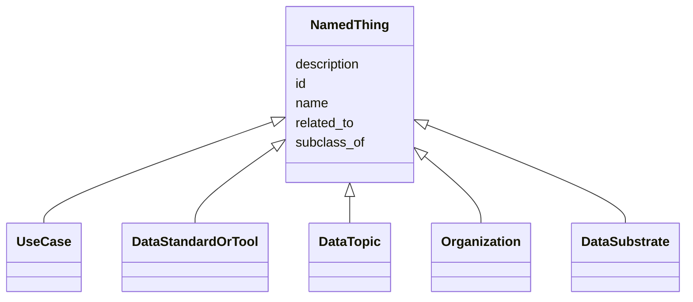

# Class: NamedThing
_A generic grouping for any identifiable entity_


URI: [schema:Thing](http://schema.org/Thing)





## Inheritance
* **NamedThing**
    * [UseCase](UseCase.md)
    * [DataStandardOrTool](DataStandardOrTool.md)
    * [DataTopic](DataTopic.md)
    * [Organization](Organization.md)
    * [DataSubstrate](DataSubstrate.md)


## Slots

| Name | Cardinality and Range | Description | Inheritance |
| ---  | --- | --- | --- |
| [id](id.md) | 1..1 <br/> [xsd:anyURI](xsd:anyURI) | A unique identifier for a thing | direct |
| [name](name.md) | 0..1 <br/> [xsd:string](xsd:string) | A human-readable name for a thing | direct |
| [description](description.md) | 0..1 <br/> [xsd:string](xsd:string) | A human-readable description for a thing | direct |
| [subclass_of](subclass_of.md) | 0..* <br/> [NamedThing](NamedThing.md) | Holds between two classes where the domain class is a specialization of the r... | direct |
| [related_to](related_to.md) | 0..* <br/> [NamedThing](NamedThing.md) | A relationship that is asserted between two named things | direct |


## Usages

| used by | used in | type | used |
| ---  | --- | --- | --- |
| [UseCase](UseCase.md) | [use_case_category](use_case_category.md) | domain | [NamedThing](NamedThing.md) |
| [UseCase](UseCase.md) | [known_limitations](known_limitations.md) | domain | [NamedThing](NamedThing.md) |
| [UseCase](UseCase.md) | [data_topics](data_topics.md) | domain | [NamedThing](NamedThing.md) |
| [UseCase](UseCase.md) | [data_substrates](data_substrates.md) | domain | [NamedThing](NamedThing.md) |
| [UseCase](UseCase.md) | [standards_and_tools_for_dgp_use](standards_and_tools_for_dgp_use.md) | domain | [NamedThing](NamedThing.md) |
| [UseCase](UseCase.md) | [alternative_standards_and_tools](alternative_standards_and_tools.md) | domain | [NamedThing](NamedThing.md) |
| [UseCase](UseCase.md) | [enables](enables.md) | domain | [NamedThing](NamedThing.md) |
| [UseCase](UseCase.md) | [involved_in_experimental_design](involved_in_experimental_design.md) | domain | [NamedThing](NamedThing.md) |
| [UseCase](UseCase.md) | [involved_in_metadata_management](involved_in_metadata_management.md) | domain | [NamedThing](NamedThing.md) |
| [UseCase](UseCase.md) | [involved_in_quality_control](involved_in_quality_control.md) | domain | [NamedThing](NamedThing.md) |
| [UseCase](UseCase.md) | [xref](xref.md) | domain | [NamedThing](NamedThing.md) |
| [UseCase](UseCase.md) | [subclass_of](subclass_of.md) | domain | [NamedThing](NamedThing.md) |
| [UseCase](UseCase.md) | [subclass_of](subclass_of.md) | range | [NamedThing](NamedThing.md) |
| [UseCase](UseCase.md) | [related_to](related_to.md) | domain | [NamedThing](NamedThing.md) |
| [UseCase](UseCase.md) | [related_to](related_to.md) | range | [NamedThing](NamedThing.md) |
| [DataStandardOrTool](DataStandardOrTool.md) | [collection](collection.md) | domain | [NamedThing](NamedThing.md) |
| [DataStandardOrTool](DataStandardOrTool.md) | [purpose_detail](purpose_detail.md) | domain | [NamedThing](NamedThing.md) |
| [DataStandardOrTool](DataStandardOrTool.md) | [is_open](is_open.md) | domain | [NamedThing](NamedThing.md) |
| [DataStandardOrTool](DataStandardOrTool.md) | [requires_registration](requires_registration.md) | domain | [NamedThing](NamedThing.md) |
| [DataStandardOrTool](DataStandardOrTool.md) | [url](url.md) | domain | [NamedThing](NamedThing.md) |
| [DataStandardOrTool](DataStandardOrTool.md) | [publication](publication.md) | domain | [NamedThing](NamedThing.md) |
| [DataStandardOrTool](DataStandardOrTool.md) | [formal_specification](formal_specification.md) | domain | [NamedThing](NamedThing.md) |
| [DataStandardOrTool](DataStandardOrTool.md) | [subclass_of](subclass_of.md) | domain | [NamedThing](NamedThing.md) |
| [DataStandardOrTool](DataStandardOrTool.md) | [subclass_of](subclass_of.md) | range | [NamedThing](NamedThing.md) |
| [DataStandardOrTool](DataStandardOrTool.md) | [related_to](related_to.md) | domain | [NamedThing](NamedThing.md) |
| [DataStandardOrTool](DataStandardOrTool.md) | [related_to](related_to.md) | range | [NamedThing](NamedThing.md) |
| [DataStandard](DataStandard.md) | [collection](collection.md) | domain | [NamedThing](NamedThing.md) |
| [DataStandard](DataStandard.md) | [purpose_detail](purpose_detail.md) | domain | [NamedThing](NamedThing.md) |
| [DataStandard](DataStandard.md) | [is_open](is_open.md) | domain | [NamedThing](NamedThing.md) |
| [DataStandard](DataStandard.md) | [requires_registration](requires_registration.md) | domain | [NamedThing](NamedThing.md) |
| [DataStandard](DataStandard.md) | [url](url.md) | domain | [NamedThing](NamedThing.md) |
| [DataStandard](DataStandard.md) | [publication](publication.md) | domain | [NamedThing](NamedThing.md) |
| [DataStandard](DataStandard.md) | [formal_specification](formal_specification.md) | domain | [NamedThing](NamedThing.md) |
| [DataStandard](DataStandard.md) | [subclass_of](subclass_of.md) | domain | [NamedThing](NamedThing.md) |
| [DataStandard](DataStandard.md) | [subclass_of](subclass_of.md) | range | [NamedThing](NamedThing.md) |
| [DataStandard](DataStandard.md) | [related_to](related_to.md) | domain | [NamedThing](NamedThing.md) |
| [DataStandard](DataStandard.md) | [related_to](related_to.md) | range | [NamedThing](NamedThing.md) |
| [BiomedicalStandard](BiomedicalStandard.md) | [collection](collection.md) | domain | [NamedThing](NamedThing.md) |
| [BiomedicalStandard](BiomedicalStandard.md) | [purpose_detail](purpose_detail.md) | domain | [NamedThing](NamedThing.md) |
| [BiomedicalStandard](BiomedicalStandard.md) | [is_open](is_open.md) | domain | [NamedThing](NamedThing.md) |
| [BiomedicalStandard](BiomedicalStandard.md) | [requires_registration](requires_registration.md) | domain | [NamedThing](NamedThing.md) |
| [BiomedicalStandard](BiomedicalStandard.md) | [url](url.md) | domain | [NamedThing](NamedThing.md) |
| [BiomedicalStandard](BiomedicalStandard.md) | [publication](publication.md) | domain | [NamedThing](NamedThing.md) |
| [BiomedicalStandard](BiomedicalStandard.md) | [formal_specification](formal_specification.md) | domain | [NamedThing](NamedThing.md) |
| [BiomedicalStandard](BiomedicalStandard.md) | [subclass_of](subclass_of.md) | domain | [NamedThing](NamedThing.md) |
| [BiomedicalStandard](BiomedicalStandard.md) | [subclass_of](subclass_of.md) | range | [NamedThing](NamedThing.md) |
| [BiomedicalStandard](BiomedicalStandard.md) | [related_to](related_to.md) | domain | [NamedThing](NamedThing.md) |
| [BiomedicalStandard](BiomedicalStandard.md) | [related_to](related_to.md) | range | [NamedThing](NamedThing.md) |
| [Registry](Registry.md) | [collection](collection.md) | domain | [NamedThing](NamedThing.md) |
| [Registry](Registry.md) | [purpose_detail](purpose_detail.md) | domain | [NamedThing](NamedThing.md) |
| [Registry](Registry.md) | [is_open](is_open.md) | domain | [NamedThing](NamedThing.md) |
| [Registry](Registry.md) | [requires_registration](requires_registration.md) | domain | [NamedThing](NamedThing.md) |
| [Registry](Registry.md) | [url](url.md) | domain | [NamedThing](NamedThing.md) |
| [Registry](Registry.md) | [publication](publication.md) | domain | [NamedThing](NamedThing.md) |
| [Registry](Registry.md) | [formal_specification](formal_specification.md) | domain | [NamedThing](NamedThing.md) |
| [Registry](Registry.md) | [subclass_of](subclass_of.md) | domain | [NamedThing](NamedThing.md) |
| [Registry](Registry.md) | [subclass_of](subclass_of.md) | range | [NamedThing](NamedThing.md) |
| [Registry](Registry.md) | [related_to](related_to.md) | domain | [NamedThing](NamedThing.md) |
| [Registry](Registry.md) | [related_to](related_to.md) | range | [NamedThing](NamedThing.md) |
| [OntologyOrVocabulary](OntologyOrVocabulary.md) | [collection](collection.md) | domain | [NamedThing](NamedThing.md) |
| [OntologyOrVocabulary](OntologyOrVocabulary.md) | [purpose_detail](purpose_detail.md) | domain | [NamedThing](NamedThing.md) |
| [OntologyOrVocabulary](OntologyOrVocabulary.md) | [is_open](is_open.md) | domain | [NamedThing](NamedThing.md) |
| [OntologyOrVocabulary](OntologyOrVocabulary.md) | [requires_registration](requires_registration.md) | domain | [NamedThing](NamedThing.md) |
| [OntologyOrVocabulary](OntologyOrVocabulary.md) | [url](url.md) | domain | [NamedThing](NamedThing.md) |
| [OntologyOrVocabulary](OntologyOrVocabulary.md) | [publication](publication.md) | domain | [NamedThing](NamedThing.md) |
| [OntologyOrVocabulary](OntologyOrVocabulary.md) | [formal_specification](formal_specification.md) | domain | [NamedThing](NamedThing.md) |
| [OntologyOrVocabulary](OntologyOrVocabulary.md) | [subclass_of](subclass_of.md) | domain | [NamedThing](NamedThing.md) |
| [OntologyOrVocabulary](OntologyOrVocabulary.md) | [subclass_of](subclass_of.md) | range | [NamedThing](NamedThing.md) |
| [OntologyOrVocabulary](OntologyOrVocabulary.md) | [related_to](related_to.md) | domain | [NamedThing](NamedThing.md) |
| [OntologyOrVocabulary](OntologyOrVocabulary.md) | [related_to](related_to.md) | range | [NamedThing](NamedThing.md) |
| [ModelRepository](ModelRepository.md) | [collection](collection.md) | domain | [NamedThing](NamedThing.md) |
| [ModelRepository](ModelRepository.md) | [purpose_detail](purpose_detail.md) | domain | [NamedThing](NamedThing.md) |
| [ModelRepository](ModelRepository.md) | [is_open](is_open.md) | domain | [NamedThing](NamedThing.md) |
| [ModelRepository](ModelRepository.md) | [requires_registration](requires_registration.md) | domain | [NamedThing](NamedThing.md) |
| [ModelRepository](ModelRepository.md) | [url](url.md) | domain | [NamedThing](NamedThing.md) |
| [ModelRepository](ModelRepository.md) | [publication](publication.md) | domain | [NamedThing](NamedThing.md) |
| [ModelRepository](ModelRepository.md) | [formal_specification](formal_specification.md) | domain | [NamedThing](NamedThing.md) |
| [ModelRepository](ModelRepository.md) | [subclass_of](subclass_of.md) | domain | [NamedThing](NamedThing.md) |
| [ModelRepository](ModelRepository.md) | [subclass_of](subclass_of.md) | range | [NamedThing](NamedThing.md) |
| [ModelRepository](ModelRepository.md) | [related_to](related_to.md) | domain | [NamedThing](NamedThing.md) |
| [ModelRepository](ModelRepository.md) | [related_to](related_to.md) | range | [NamedThing](NamedThing.md) |
| [ReferenceDataOrDataset](ReferenceDataOrDataset.md) | [collection](collection.md) | domain | [NamedThing](NamedThing.md) |
| [ReferenceDataOrDataset](ReferenceDataOrDataset.md) | [purpose_detail](purpose_detail.md) | domain | [NamedThing](NamedThing.md) |
| [ReferenceDataOrDataset](ReferenceDataOrDataset.md) | [is_open](is_open.md) | domain | [NamedThing](NamedThing.md) |
| [ReferenceDataOrDataset](ReferenceDataOrDataset.md) | [requires_registration](requires_registration.md) | domain | [NamedThing](NamedThing.md) |
| [ReferenceDataOrDataset](ReferenceDataOrDataset.md) | [url](url.md) | domain | [NamedThing](NamedThing.md) |
| [ReferenceDataOrDataset](ReferenceDataOrDataset.md) | [publication](publication.md) | domain | [NamedThing](NamedThing.md) |
| [ReferenceDataOrDataset](ReferenceDataOrDataset.md) | [formal_specification](formal_specification.md) | domain | [NamedThing](NamedThing.md) |
| [ReferenceDataOrDataset](ReferenceDataOrDataset.md) | [subclass_of](subclass_of.md) | domain | [NamedThing](NamedThing.md) |
| [ReferenceDataOrDataset](ReferenceDataOrDataset.md) | [subclass_of](subclass_of.md) | range | [NamedThing](NamedThing.md) |
| [ReferenceDataOrDataset](ReferenceDataOrDataset.md) | [related_to](related_to.md) | domain | [NamedThing](NamedThing.md) |
| [ReferenceDataOrDataset](ReferenceDataOrDataset.md) | [related_to](related_to.md) | range | [NamedThing](NamedThing.md) |
| [SoftwareOrTool](SoftwareOrTool.md) | [collection](collection.md) | domain | [NamedThing](NamedThing.md) |
| [SoftwareOrTool](SoftwareOrTool.md) | [purpose_detail](purpose_detail.md) | domain | [NamedThing](NamedThing.md) |
| [SoftwareOrTool](SoftwareOrTool.md) | [is_open](is_open.md) | domain | [NamedThing](NamedThing.md) |
| [SoftwareOrTool](SoftwareOrTool.md) | [requires_registration](requires_registration.md) | domain | [NamedThing](NamedThing.md) |
| [SoftwareOrTool](SoftwareOrTool.md) | [url](url.md) | domain | [NamedThing](NamedThing.md) |
| [SoftwareOrTool](SoftwareOrTool.md) | [publication](publication.md) | domain | [NamedThing](NamedThing.md) |
| [SoftwareOrTool](SoftwareOrTool.md) | [formal_specification](formal_specification.md) | domain | [NamedThing](NamedThing.md) |
| [SoftwareOrTool](SoftwareOrTool.md) | [subclass_of](subclass_of.md) | domain | [NamedThing](NamedThing.md) |
| [SoftwareOrTool](SoftwareOrTool.md) | [subclass_of](subclass_of.md) | range | [NamedThing](NamedThing.md) |
| [SoftwareOrTool](SoftwareOrTool.md) | [related_to](related_to.md) | domain | [NamedThing](NamedThing.md) |
| [SoftwareOrTool](SoftwareOrTool.md) | [related_to](related_to.md) | range | [NamedThing](NamedThing.md) |
| [ReferenceImplementation](ReferenceImplementation.md) | [collection](collection.md) | domain | [NamedThing](NamedThing.md) |
| [ReferenceImplementation](ReferenceImplementation.md) | [purpose_detail](purpose_detail.md) | domain | [NamedThing](NamedThing.md) |
| [ReferenceImplementation](ReferenceImplementation.md) | [is_open](is_open.md) | domain | [NamedThing](NamedThing.md) |
| [ReferenceImplementation](ReferenceImplementation.md) | [requires_registration](requires_registration.md) | domain | [NamedThing](NamedThing.md) |
| [ReferenceImplementation](ReferenceImplementation.md) | [url](url.md) | domain | [NamedThing](NamedThing.md) |
| [ReferenceImplementation](ReferenceImplementation.md) | [publication](publication.md) | domain | [NamedThing](NamedThing.md) |
| [ReferenceImplementation](ReferenceImplementation.md) | [formal_specification](formal_specification.md) | domain | [NamedThing](NamedThing.md) |
| [ReferenceImplementation](ReferenceImplementation.md) | [subclass_of](subclass_of.md) | domain | [NamedThing](NamedThing.md) |
| [ReferenceImplementation](ReferenceImplementation.md) | [subclass_of](subclass_of.md) | range | [NamedThing](NamedThing.md) |
| [ReferenceImplementation](ReferenceImplementation.md) | [related_to](related_to.md) | domain | [NamedThing](NamedThing.md) |
| [ReferenceImplementation](ReferenceImplementation.md) | [related_to](related_to.md) | range | [NamedThing](NamedThing.md) |
| [TrainingProgram](TrainingProgram.md) | [collection](collection.md) | domain | [NamedThing](NamedThing.md) |
| [TrainingProgram](TrainingProgram.md) | [purpose_detail](purpose_detail.md) | domain | [NamedThing](NamedThing.md) |
| [TrainingProgram](TrainingProgram.md) | [is_open](is_open.md) | domain | [NamedThing](NamedThing.md) |
| [TrainingProgram](TrainingProgram.md) | [requires_registration](requires_registration.md) | domain | [NamedThing](NamedThing.md) |
| [TrainingProgram](TrainingProgram.md) | [url](url.md) | domain | [NamedThing](NamedThing.md) |
| [TrainingProgram](TrainingProgram.md) | [publication](publication.md) | domain | [NamedThing](NamedThing.md) |
| [TrainingProgram](TrainingProgram.md) | [formal_specification](formal_specification.md) | domain | [NamedThing](NamedThing.md) |
| [TrainingProgram](TrainingProgram.md) | [subclass_of](subclass_of.md) | domain | [NamedThing](NamedThing.md) |
| [TrainingProgram](TrainingProgram.md) | [subclass_of](subclass_of.md) | range | [NamedThing](NamedThing.md) |
| [TrainingProgram](TrainingProgram.md) | [related_to](related_to.md) | domain | [NamedThing](NamedThing.md) |
| [TrainingProgram](TrainingProgram.md) | [related_to](related_to.md) | range | [NamedThing](NamedThing.md) |
| [DataTopic](DataTopic.md) | [subclass_of](subclass_of.md) | domain | [NamedThing](NamedThing.md) |
| [DataTopic](DataTopic.md) | [subclass_of](subclass_of.md) | range | [NamedThing](NamedThing.md) |
| [DataTopic](DataTopic.md) | [related_to](related_to.md) | domain | [NamedThing](NamedThing.md) |
| [DataTopic](DataTopic.md) | [related_to](related_to.md) | range | [NamedThing](NamedThing.md) |
| [NamedThing](NamedThing.md) | [subclass_of](subclass_of.md) | domain | [NamedThing](NamedThing.md) |
| [NamedThing](NamedThing.md) | [subclass_of](subclass_of.md) | range | [NamedThing](NamedThing.md) |
| [NamedThing](NamedThing.md) | [related_to](related_to.md) | domain | [NamedThing](NamedThing.md) |
| [NamedThing](NamedThing.md) | [related_to](related_to.md) | range | [NamedThing](NamedThing.md) |
| [Organization](Organization.md) | [url](url.md) | domain | [NamedThing](NamedThing.md) |
| [Organization](Organization.md) | [related_to](related_to.md) | domain | [NamedThing](NamedThing.md) |
| [Organization](Organization.md) | [related_to](related_to.md) | range | [NamedThing](NamedThing.md) |
| [Organization](Organization.md) | [subclass_of](subclass_of.md) | domain | [NamedThing](NamedThing.md) |
| [Organization](Organization.md) | [subclass_of](subclass_of.md) | range | [NamedThing](NamedThing.md) |
| [DataSubstrate](DataSubstrate.md) | [metadata_storage](metadata_storage.md) | domain | [NamedThing](NamedThing.md) |
| [DataSubstrate](DataSubstrate.md) | [file_extensions](file_extensions.md) | domain | [NamedThing](NamedThing.md) |
| [DataSubstrate](DataSubstrate.md) | [limitations](limitations.md) | domain | [NamedThing](NamedThing.md) |
| [DataSubstrate](DataSubstrate.md) | [subclass_of](subclass_of.md) | domain | [NamedThing](NamedThing.md) |
| [DataSubstrate](DataSubstrate.md) | [subclass_of](subclass_of.md) | range | [NamedThing](NamedThing.md) |
| [DataSubstrate](DataSubstrate.md) | [related_to](related_to.md) | domain | [NamedThing](NamedThing.md) |
| [DataSubstrate](DataSubstrate.md) | [related_to](related_to.md) | range | [NamedThing](NamedThing.md) |


## Identifier and Mapping Information


### Schema Source


* from schema: https://w3id.org/bridge2ai/standards-schema


## Mappings

| Mapping Type | Mapped Value |
| ---  | ---  |
| self | schema:Thing |
| native | STANDARDS:NamedThing |


## LinkML Source

<!-- TODO: investigate https://stackoverflow.com/questions/37606292/how-to-create-tabbed-code-blocks-in-mkdocs-or-sphinx -->

### Direct

<details>
```yaml
name: NamedThing
description: A generic grouping for any identifiable entity
from_schema: https://w3id.org/bridge2ai/standards-schema
rank: 1000
slots:
- id
- name
- description
- subclass_of
- related_to
class_uri: schema:Thing

```
</details>

### Induced

<details>
```yaml
name: NamedThing
description: A generic grouping for any identifiable entity
from_schema: https://w3id.org/bridge2ai/standards-schema
rank: 1000
attributes:
  id:
    name: id
    description: A unique identifier for a thing.
    from_schema: https://w3id.org/bridge2ai/standards-schema
    rank: 1000
    slot_uri: schema:identifier
    identifier: true
    alias: id
    owner: NamedThing
    domain_of:
    - NamedThing
    range: uriorcurie
    required: true
  name:
    name: name
    description: A human-readable name for a thing.
    from_schema: https://w3id.org/bridge2ai/standards-schema
    rank: 1000
    slot_uri: schema:name
    alias: name
    owner: NamedThing
    domain_of:
    - NamedThing
    range: string
  description:
    name: description
    description: A human-readable description for a thing.
    from_schema: https://w3id.org/bridge2ai/standards-schema
    rank: 1000
    slot_uri: schema:description
    alias: description
    owner: NamedThing
    domain_of:
    - NamedThing
    range: string
  subclass_of:
    name: subclass_of
    description: Holds between two classes where the domain class is a specialization
      of the range class.
    from_schema: https://w3id.org/bridge2ai/standards-schema
    exact_mappings:
    - rdfs:subClassOf
    - MESH:isa
    narrow_mappings:
    - rdfs:subPropertyOf
    rank: 1000
    is_a: related_to
    domain: NamedThing
    multivalued: true
    inherited: true
    alias: subclass_of
    owner: NamedThing
    domain_of:
    - NamedThing
    range: NamedThing
  related_to:
    name: related_to
    description: A relationship that is asserted between two named things.
    from_schema: https://w3id.org/bridge2ai/standards-schema
    rank: 1000
    domain: NamedThing
    multivalued: true
    inherited: true
    alias: related_to
    owner: NamedThing
    domain_of:
    - NamedThing
    - Organization
    symmetric: true
    range: NamedThing
class_uri: schema:Thing

```
</details>