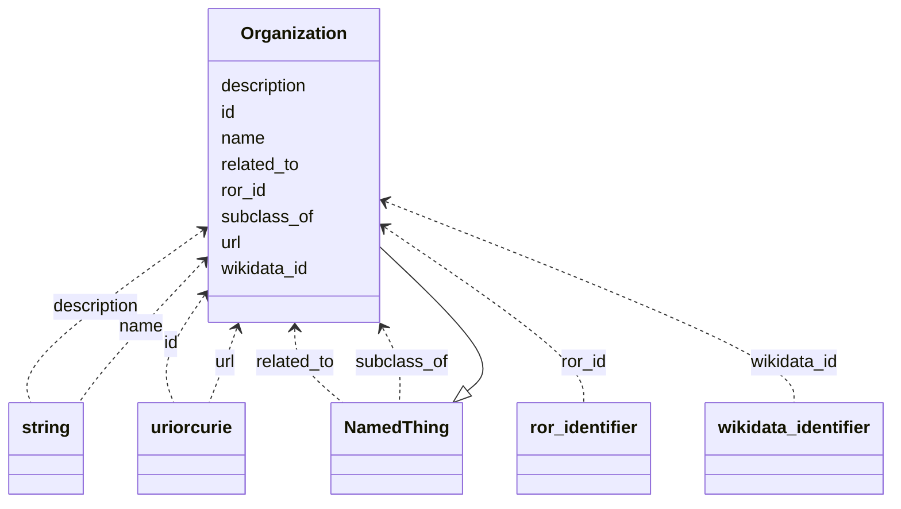

# Class: Organization
_Represents a group or organization related to or responsible for one or more Bridge2AI standards._


URI: [https://w3id.org/bridge2ai/standards-schema-all/:Organization](https://w3id.org/bridge2ai/standards-schema-all/:Organization)





## Inheritance
* [NamedThing](NamedThing.md)
    * **Organization**


## Slots

| Name | Cardinality and Range | Description | Inheritance |
| ---  | --- | --- | --- |
| [ror_id](ror_id.md) | 0..1 <br/> [RorIdentifier](RorIdentifier.md) |  | direct |
| [wikidata_id](wikidata_id.md) | 0..1 <br/> [WikidataIdentifier](WikidataIdentifier.md) |  | direct |
| [url](url.md) | 0..1 <br/> [Uriorcurie](Uriorcurie.md) | URL for basic documentation of the standard or tool | direct |
| [related_to](related_to.md) | 0..* <br/> [NamedThing](NamedThing.md) | A relationship that is asserted between two named things | direct |
| [id](id.md) | 1..1 <br/> [Uriorcurie](Uriorcurie.md) | A unique identifier for a thing | [NamedThing](NamedThing.md) |
| [name](name.md) | 0..1 <br/> [String](String.md) | A human-readable name for a thing | [NamedThing](NamedThing.md) |
| [description](description.md) | 0..1 <br/> [String](String.md) | A human-readable description for a thing | [NamedThing](NamedThing.md) |
| [subclass_of](subclass_of.md) | 0..* <br/> [NamedThing](NamedThing.md) | Holds between two classes where the domain class is a specialization of the r... | [NamedThing](NamedThing.md) |


## Usages

| used by | used in | type | used |
| ---  | --- | --- | --- |
| [DataStandardOrTool](DataStandardOrTool.md) | [has_relevant_organization](has_relevant_organization.md) | range | [Organization](Organization.md) |
| [DataStandard](DataStandard.md) | [has_relevant_organization](has_relevant_organization.md) | range | [Organization](Organization.md) |
| [BiomedicalStandard](BiomedicalStandard.md) | [has_relevant_organization](has_relevant_organization.md) | range | [Organization](Organization.md) |
| [Registry](Registry.md) | [has_relevant_organization](has_relevant_organization.md) | range | [Organization](Organization.md) |
| [OntologyOrVocabulary](OntologyOrVocabulary.md) | [has_relevant_organization](has_relevant_organization.md) | range | [Organization](Organization.md) |
| [ModelRepository](ModelRepository.md) | [has_relevant_organization](has_relevant_organization.md) | range | [Organization](Organization.md) |
| [ReferenceDataOrDataset](ReferenceDataOrDataset.md) | [has_relevant_organization](has_relevant_organization.md) | range | [Organization](Organization.md) |
| [SoftwareOrTool](SoftwareOrTool.md) | [has_relevant_organization](has_relevant_organization.md) | range | [Organization](Organization.md) |
| [ReferenceImplementation](ReferenceImplementation.md) | [has_relevant_organization](has_relevant_organization.md) | range | [Organization](Organization.md) |
| [TrainingProgram](TrainingProgram.md) | [has_relevant_organization](has_relevant_organization.md) | range | [Organization](Organization.md) |
| [OrganizationContainer](OrganizationContainer.md) | [organizations](organizations.md) | range | [Organization](Organization.md) |


## Identifier and Mapping Information


### Schema Source


* from schema: https://w3id.org/bridge2ai/standards-schema-all


## Mappings

| Mapping Type | Mapped Value |
| ---  | ---  |
| self | https://w3id.org/bridge2ai/standards-schema-all/:Organization |
| native | https://w3id.org/bridge2ai/standards-schema-all/:Organization |


## LinkML Source

<!-- TODO: investigate https://stackoverflow.com/questions/37606292/how-to-create-tabbed-code-blocks-in-mkdocs-or-sphinx -->

### Direct

<details>
```yaml
name: Organization
description: Represents a group or organization related to or responsible for one
  or more Bridge2AI standards.
from_schema: https://w3id.org/bridge2ai/standards-schema-all
rank: 1000
is_a: NamedThing
slots:
- ror_id
- wikidata_id
- url
- related_to

```
</details>

### Induced

<details>
```yaml
name: Organization
description: Represents a group or organization related to or responsible for one
  or more Bridge2AI standards.
from_schema: https://w3id.org/bridge2ai/standards-schema-all
rank: 1000
is_a: NamedThing
attributes:
  ror_id:
    name: ror_id
    examples:
    - value: ROR:02mp31p96
    from_schema: https://w3id.org/bridge2ai/standards-schema-all
    rank: 1000
    values_from:
    - ROR
    alias: ror_id
    owner: Organization
    domain_of:
    - Organization
    range: ror_identifier
  wikidata_id:
    name: wikidata_id
    examples:
    - value: WIKIDATA:Q282186
    from_schema: https://w3id.org/bridge2ai/standards-schema-all
    rank: 1000
    values_from:
    - WIKIDATA
    alias: wikidata_id
    owner: Organization
    domain_of:
    - Organization
    range: wikidata_identifier
  url:
    name: url
    description: URL for basic documentation of the standard or tool.
    from_schema: https://w3id.org/bridge2ai/standards-schema-all
    rank: 1000
    is_a: node property
    domain: NamedThing
    alias: url
    owner: Organization
    domain_of:
    - DataStandardOrTool
    - Organization
    range: uriorcurie
  related_to:
    name: related_to
    description: A relationship that is asserted between two named things.
    from_schema: https://w3id.org/bridge2ai/standards-schema-all
    rank: 1000
    domain: NamedThing
    multivalued: true
    inherited: true
    alias: related_to
    owner: Organization
    domain_of:
    - NamedThing
    - Organization
    symmetric: true
    range: NamedThing
  id:
    name: id
    description: A unique identifier for a thing.
    from_schema: https://w3id.org/bridge2ai/standards-schema-all
    rank: 1000
    slot_uri: schema:identifier
    identifier: true
    alias: id
    owner: Organization
    domain_of:
    - NamedThing
    range: uriorcurie
    required: true
  name:
    name: name
    description: A human-readable name for a thing.
    from_schema: https://w3id.org/bridge2ai/standards-schema-all
    rank: 1000
    slot_uri: schema:name
    alias: name
    owner: Organization
    domain_of:
    - NamedThing
    range: string
  description:
    name: description
    description: A human-readable description for a thing.
    from_schema: https://w3id.org/bridge2ai/standards-schema-all
    rank: 1000
    slot_uri: schema:description
    alias: description
    owner: Organization
    domain_of:
    - NamedThing
    range: string
  subclass_of:
    name: subclass_of
    description: Holds between two classes where the domain class is a specialization
      of the range class.
    from_schema: https://w3id.org/bridge2ai/standards-schema-all
    exact_mappings:
    - rdfs:subClassOf
    - MESH:isa
    narrow_mappings:
    - rdfs:subPropertyOf
    rank: 1000
    is_a: related_to
    domain: NamedThing
    multivalued: true
    inherited: true
    alias: subclass_of
    owner: Organization
    domain_of:
    - NamedThing
    range: NamedThing

```
</details>