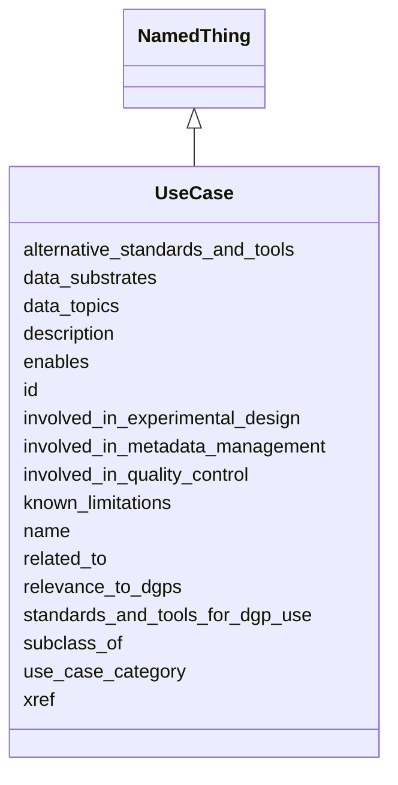

# Class: UseCase
_Represents a use case for Bridge2AI standards._


URI: [STANDARDSUSECASE:UseCase](https://w3id.org/bridge2ai/standards-usecase-schema/UseCase)





## Inheritance
* [NamedThing](NamedThing.md)
    * **UseCase**


## Slots

| Name | Cardinality and Range | Description | Inheritance |
| ---  | --- | --- | --- |
| [use_case_category](use_case_category.md) | 0..1 <br/> [UseCaseCategory](UseCaseCategory.md) | Category of the UseCase | direct |
| [known_limitations](known_limitations.md) | 0..1 <br/> [xsd:string](xsd:string) | Any current obstacles to implementing this use case | direct |
| [relevance_to_dgps](relevance_to_dgps.md) | 0..* <br/> [DataGeneratingProject](DataGeneratingProject.md) | Relevance of the use case to one or more DGPs | direct |
| [data_topics](data_topics.md) | 0..* <br/> [DataTopic](DataTopic.md) | Relevance of the use case to one or more data topics | direct |
| [data_substrates](data_substrates.md) | 0..* <br/> [DataSubstrate](DataSubstrate.md) | Relevance of the use case to one or more data substrates | direct |
| [standards_and_tools_for_dgp_use](standards_and_tools_for_dgp_use.md) | 0..* <br/> [DataStandardOrTool](DataStandardOrTool.md) | List of identifiers of standards and tools; those planned to be used, or alre... | direct |
| [alternative_standards_and_tools](alternative_standards_and_tools.md) | 0..* <br/> [DataStandardOrTool](DataStandardOrTool.md) | List of identifiers of standards and tools; those not explicitly planned to b... | direct |
| [enables](enables.md) | 0..* <br/> [UseCase](UseCase.md) | Other use case(s) this use case supports or makes possible | direct |
| [involved_in_experimental_design](involved_in_experimental_design.md) | 0..1 <br/> [xsd:boolean](xsd:boolean) | True if use case is likely to be implemented as part of an experimental proce... | direct |
| [involved_in_metadata_management](involved_in_metadata_management.md) | 0..1 <br/> [xsd:boolean](xsd:boolean) | True if use case is likely to be implemented as part of metadata indexing, sa... | direct |
| [involved_in_quality_control](involved_in_quality_control.md) | 0..1 <br/> [xsd:boolean](xsd:boolean) | True is use case is likely to be implemented as part of data validation opera... | direct |
| [xref](xref.md) | 0..* <br/> [xsd:anyURI](xsd:anyURI) | URI of corresponding class in an ontology of experimental procedures, in CURI... | direct |
| [id](id.md) | 1..1 <br/> [xsd:anyURI](xsd:anyURI) | A unique identifier for a thing | [NamedThing](NamedThing.md) |
| [name](name.md) | 0..1 <br/> [xsd:string](xsd:string) | A human-readable name for a thing | [NamedThing](NamedThing.md) |
| [description](description.md) | 0..1 <br/> [xsd:string](xsd:string) | A human-readable description for a thing | [NamedThing](NamedThing.md) |
| [subclass_of](subclass_of.md) | 0..* <br/> [NamedThing](NamedThing.md) | Holds between two classes where the domain class is a specialization of the r... | [NamedThing](NamedThing.md) |
| [related_to](related_to.md) | 0..* <br/> [NamedThing](NamedThing.md) | A relationship that is asserted between two named things | [NamedThing](NamedThing.md) |


## Usages

| used by | used in | type | used |
| ---  | --- | --- | --- |
| [UseCase](UseCase.md) | [enables](enables.md) | range | [UseCase](UseCase.md) |
| [UseCaseContainer](UseCaseContainer.md) | [use_cases](use_cases.md) | range | [UseCase](UseCase.md) |


## Identifier and Mapping Information


### Schema Source


* from schema: https://w3id.org/bridge2ai/standards-usecase-schema


## Mappings

| Mapping Type | Mapped Value |
| ---  | ---  |
| self | STANDARDSUSECASE:UseCase |
| native | STANDARDSUSECASE:UseCase |


## LinkML Source

<!-- TODO: investigate https://stackoverflow.com/questions/37606292/how-to-create-tabbed-code-blocks-in-mkdocs-or-sphinx -->

### Direct

<details>
```yaml
name: UseCase
description: Represents a use case for Bridge2AI standards.
from_schema: https://w3id.org/bridge2ai/standards-usecase-schema
rank: 1000
is_a: NamedThing
slots:
- use_case_category
- known_limitations
- relevance_to_dgps
- data_topics
- data_substrates
- standards_and_tools_for_dgp_use
- alternative_standards_and_tools
- enables
- involved_in_experimental_design
- involved_in_metadata_management
- involved_in_quality_control
- xref
slot_usage:
  use_case_category:
    name: use_case_category
    domain_of:
    - UseCase
    - UseCase
    required: true

```
</details>

### Induced

<details>
```yaml
name: UseCase
description: Represents a use case for Bridge2AI standards.
from_schema: https://w3id.org/bridge2ai/standards-usecase-schema
rank: 1000
is_a: NamedThing
slot_usage:
  use_case_category:
    name: use_case_category
    domain_of:
    - UseCase
    - UseCase
    required: true
attributes:
  use_case_category:
    name: use_case_category
    description: Category of the UseCase. Not all projects will incorporate use cases
      in all categories.
    from_schema: https://w3id.org/bridge2ai/standards-usecase-schema
    rank: 1000
    is_a: node property
    domain: NamedThing
    alias: use_case_category
    owner: UseCase
    domain_of:
    - UseCase
    range: UseCaseCategory
    required: true
  known_limitations:
    name: known_limitations
    description: Any current obstacles to implementing this use case. This could be
      a selection from one or more predefined categories including lack of standards,
      lack of relevant patient cohort, lack of funding, etc.
    from_schema: https://w3id.org/bridge2ai/standards-usecase-schema
    rank: 1000
    is_a: node property
    domain: NamedThing
    alias: known_limitations
    owner: UseCase
    domain_of:
    - UseCase
    range: string
  relevance_to_dgps:
    name: relevance_to_dgps
    description: Relevance of the use case to one or more DGPs.
    from_schema: https://w3id.org/bridge2ai/standards-usecase-schema
    rank: 1000
    multivalued: true
    alias: relevance_to_dgps
    owner: UseCase
    domain_of:
    - UseCase
    range: DataGeneratingProject
  data_topics:
    name: data_topics
    description: Relevance of the use case to one or more data topics.
    from_schema: https://w3id.org/bridge2ai/standards-usecase-schema
    rank: 1000
    is_a: node property
    domain: NamedThing
    multivalued: true
    alias: data_topics
    owner: UseCase
    domain_of:
    - UseCase
    range: DataTopic
  data_substrates:
    name: data_substrates
    description: Relevance of the use case to one or more data substrates.
    from_schema: https://w3id.org/bridge2ai/standards-usecase-schema
    rank: 1000
    is_a: node property
    domain: NamedThing
    multivalued: true
    alias: data_substrates
    owner: UseCase
    domain_of:
    - UseCase
    range: DataSubstrate
  standards_and_tools_for_dgp_use:
    name: standards_and_tools_for_dgp_use
    description: List of identifiers of standards and tools; those planned to be used,
      or already in use, by one or more Bridge2AI DGPs in addressing this use case,
      from those in the Standards Registry, or TBD if standards/tools not yet finalized
      for this use case.
    from_schema: https://w3id.org/bridge2ai/standards-usecase-schema
    rank: 1000
    is_a: node property
    domain: NamedThing
    multivalued: true
    alias: standards_and_tools_for_dgp_use
    owner: UseCase
    domain_of:
    - UseCase
    range: DataStandardOrTool
  alternative_standards_and_tools:
    name: alternative_standards_and_tools
    description: List of identifiers of standards and tools; those not explicitly
      planned to be used, by one or more Bridge2AI DGPs in addressing this use case
      but serving as viable alternatives, from those in the Standards Registry.
    from_schema: https://w3id.org/bridge2ai/standards-usecase-schema
    rank: 1000
    is_a: node property
    domain: NamedThing
    multivalued: true
    alias: alternative_standards_and_tools
    owner: UseCase
    domain_of:
    - UseCase
    range: DataStandardOrTool
  enables:
    name: enables
    description: Other use case(s) this use case supports or makes possible.
    from_schema: https://w3id.org/bridge2ai/standards-usecase-schema
    rank: 1000
    is_a: node property
    domain: NamedThing
    multivalued: true
    alias: enables
    owner: UseCase
    domain_of:
    - UseCase
    range: UseCase
  involved_in_experimental_design:
    name: involved_in_experimental_design
    description: True if use case is likely to be implemented as part of an experimental
      procedure or collection of data to be used as part of an experiment.
    from_schema: https://w3id.org/bridge2ai/standards-usecase-schema
    rank: 1000
    is_a: node property
    domain: NamedThing
    alias: involved_in_experimental_design
    owner: UseCase
    domain_of:
    - UseCase
    range: boolean
  involved_in_metadata_management:
    name: involved_in_metadata_management
    description: True if use case is likely to be implemented as part of metadata
      indexing, sample tracking, or any other storage of high-level data properties.
      Includes use cases in which metadata will be collected along with data.
    from_schema: https://w3id.org/bridge2ai/standards-usecase-schema
    rank: 1000
    is_a: node property
    domain: NamedThing
    alias: involved_in_metadata_management
    owner: UseCase
    domain_of:
    - UseCase
    range: boolean
  involved_in_quality_control:
    name: involved_in_quality_control
    description: True is use case is likely to be implemented as part of data validation
      operations.
    from_schema: https://w3id.org/bridge2ai/standards-usecase-schema
    rank: 1000
    is_a: node property
    domain: NamedThing
    alias: involved_in_quality_control
    owner: UseCase
    domain_of:
    - UseCase
    range: boolean
  xref:
    name: xref
    description: URI of corresponding class in an ontology of experimental procedures,
      in CURIE form.
    from_schema: https://w3id.org/bridge2ai/standards-schema
    aliases:
    - dbxref
    - Dbxref
    - DbXref
    rank: 1000
    is_a: node property
    domain: NamedThing
    multivalued: true
    alias: xref
    owner: UseCase
    domain_of:
    - UseCase
    range: uriorcurie
  id:
    name: id
    description: A unique identifier for a thing.
    from_schema: https://w3id.org/bridge2ai/standards-schema
    rank: 1000
    slot_uri: schema:identifier
    identifier: true
    alias: id
    owner: UseCase
    domain_of:
    - NamedThing
    range: uriorcurie
    required: true
  name:
    name: name
    description: A human-readable name for a thing.
    from_schema: https://w3id.org/bridge2ai/standards-schema
    rank: 1000
    slot_uri: schema:name
    alias: name
    owner: UseCase
    domain_of:
    - NamedThing
    range: string
  description:
    name: description
    description: A human-readable description for a thing.
    from_schema: https://w3id.org/bridge2ai/standards-schema
    rank: 1000
    slot_uri: schema:description
    alias: description
    owner: UseCase
    domain_of:
    - NamedThing
    range: string
  subclass_of:
    name: subclass_of
    description: Holds between two classes where the domain class is a specialization
      of the range class.
    from_schema: https://w3id.org/bridge2ai/standards-schema
    exact_mappings:
    - rdfs:subClassOf
    - MESH:isa
    narrow_mappings:
    - rdfs:subPropertyOf
    rank: 1000
    is_a: related_to
    domain: NamedThing
    multivalued: true
    inherited: true
    alias: subclass_of
    owner: UseCase
    domain_of:
    - NamedThing
    range: NamedThing
  related_to:
    name: related_to
    description: A relationship that is asserted between two named things.
    from_schema: https://w3id.org/bridge2ai/standards-schema
    rank: 1000
    domain: NamedThing
    multivalued: true
    inherited: true
    alias: related_to
    owner: UseCase
    domain_of:
    - NamedThing
    - Organization
    symmetric: true
    range: NamedThing

```
</details>