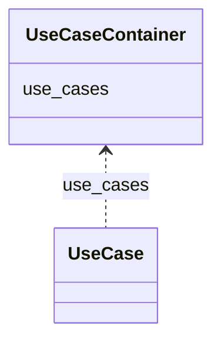

# Class: UseCaseContainer
_A container for UseCase._


URI: [https://w3id.org/bridge2ai/standards-schema-all/:UseCaseContainer](https://w3id.org/bridge2ai/standards-schema-all/:UseCaseContainer)





<!-- no inheritance hierarchy -->


## Slots

| Name | Cardinality and Range | Description | Inheritance |
| ---  | --- | --- | --- |
| [use_cases](use_cases.md) | 0..* <br/> [UseCase](UseCase.md) |  | direct |


## Identifier and Mapping Information


### Schema Source


* from schema: https://w3id.org/bridge2ai/standards-schema-all


## Mappings

| Mapping Type | Mapped Value |
| ---  | ---  |
| self | https://w3id.org/bridge2ai/standards-schema-all/:UseCaseContainer |
| native | https://w3id.org/bridge2ai/standards-schema-all/:UseCaseContainer |


## LinkML Source

<!-- TODO: investigate https://stackoverflow.com/questions/37606292/how-to-create-tabbed-code-blocks-in-mkdocs-or-sphinx -->

### Direct

<details>
```yaml
name: UseCaseContainer
description: A container for UseCase.
from_schema: https://w3id.org/bridge2ai/standards-schema-all
rank: 1000
slots:
- use_cases

```
</details>

### Induced

<details>
```yaml
name: UseCaseContainer
description: A container for UseCase.
from_schema: https://w3id.org/bridge2ai/standards-schema-all
rank: 1000
attributes:
  use_cases:
    name: use_cases
    from_schema: https://w3id.org/bridge2ai/standards-schema-all
    rank: 1000
    multivalued: true
    alias: use_cases
    owner: UseCaseContainer
    domain_of:
    - UseCaseContainer
    range: UseCase
    inlined: true
    inlined_as_list: true

```
</details>