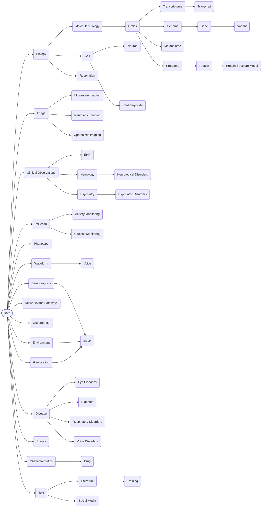

# Topics in the Bridge2AI Standards Explorer

The following topics are used in the Standards Explorer:

## Topic Hierarchy

Below is an interactive Mermaid diagram representing a subset of the topic hierarchy. Click any node to navigate to its page.

> Note: For readability, some cross-links (e.g., multi-parent relationships) are not shown.
