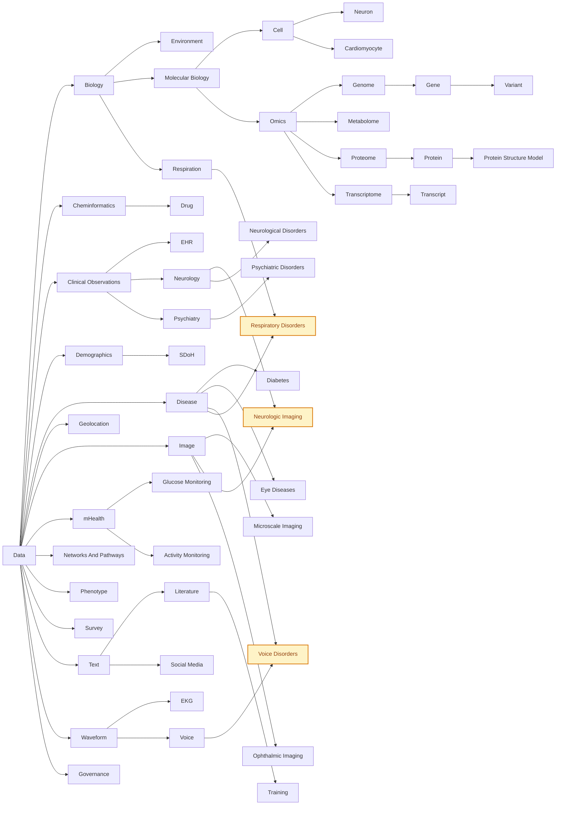

# b2ai Topic Hierarchy — Full DAG

52 topics. 1 root (`Data`). 3 multi-parent topics (highlighted): Neurologic Imaging,
Voice Disorders, Respiratory Disorders. Max depth from any node to the root: 6.

Generated from `apps/portals/b2ai.standards/ignore/DataTopic.csv`.

## Multi-parent topics — the polyhierarchy cases

These are the only topics where the widget will render duplicate rows.

| Topic | Parents |
|-------|---------|
| Neurologic Imaging | Image, Neurology |
| Voice Disorders | Disease, Voice |
| Respiratory Disorders | Disease, Respiration |

All three are leaves (no children). When mocking the "multi-parent AND multi-child"
case (e.g. B5, B6 in `topic-hierarchy-mock.html`), the multi-child side is
**fabricated** — no real topic in this dataset has both.

## Useful subtrees for mock states

- **Single-parent path with depth + branching** — `Omics` (depth 3 from root; 4 children;
  Genome has Gene → Variant beneath it for deeper descendant demos).
- **Polyhierarchy demo** — `Neurologic Imaging`. Image is at depth 2, Neurology at depth 3
  via Clinical Observations.
- **Deepest descendant chains** — Omics → Genome → Gene → Variant (5 from root) and
  Omics → Proteome → Protein → Protein Structure Model (5 from root).
